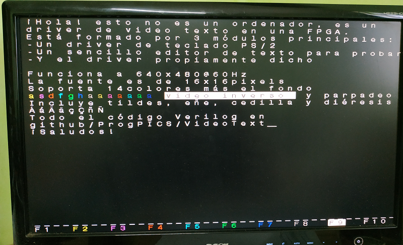

# VideoText
## Video driver in Verilog

It's composed of 3 main modules, furthermore a top level:
- a PS/2 keyboard driver, with low pass filter for noisy signal, extended keys support and caps lock and altgr features
- a simple text editor with backspace, 14 colors more background, inverted video and blinky text
- video driver itself with a resolution of 640x480 pixels @ 60 Hz

Font is 16x16 pixels monotype

Other files are: font source acting as a ROM, an initialized Video RAM with menu and the keycode to ASCII map

For debugging, also include: a 7 segment display module to show over the board the ASCII code and the status of CAPS LOCK, SHIFT and ALT key using the onboard LEDs

